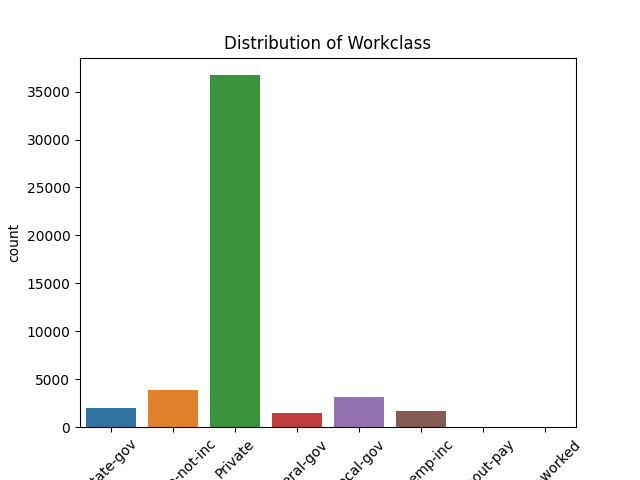
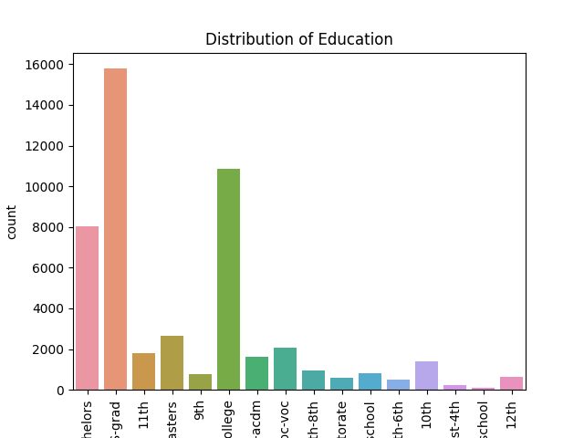
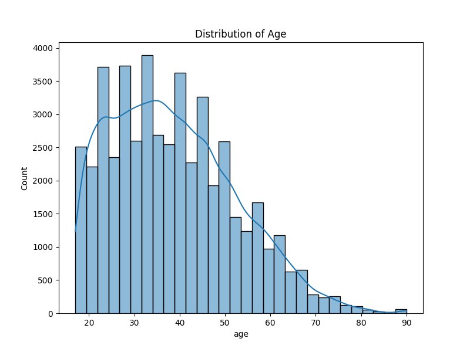
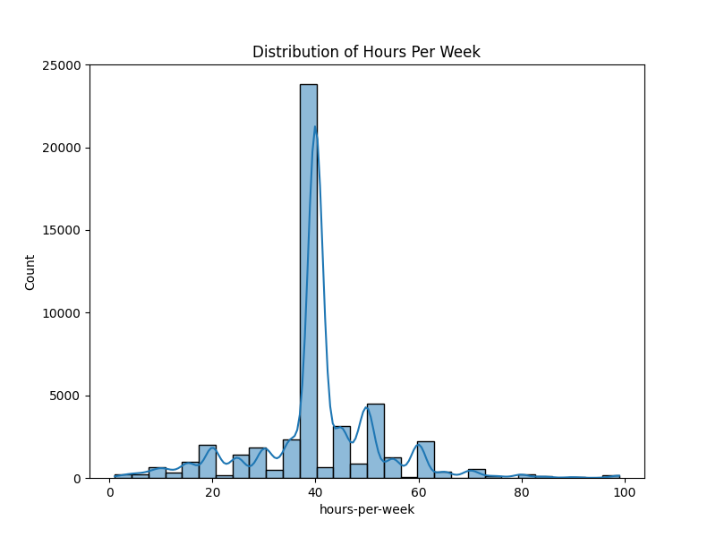
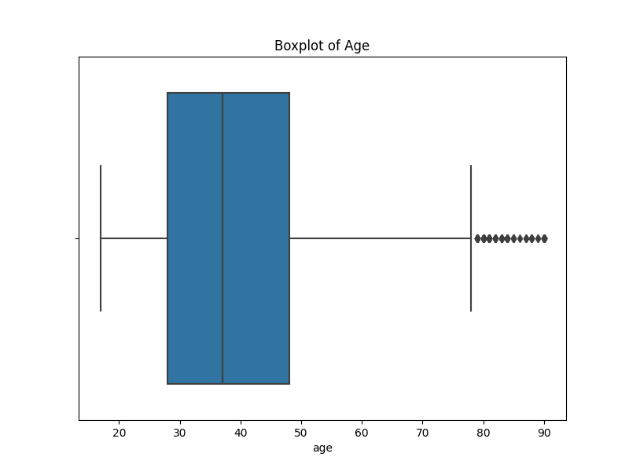
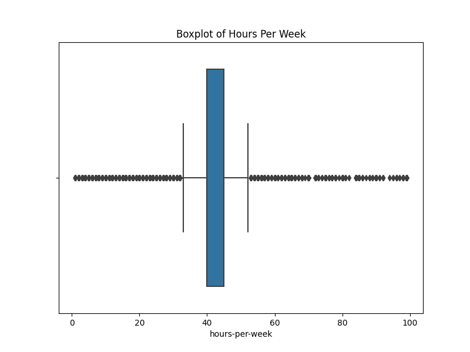
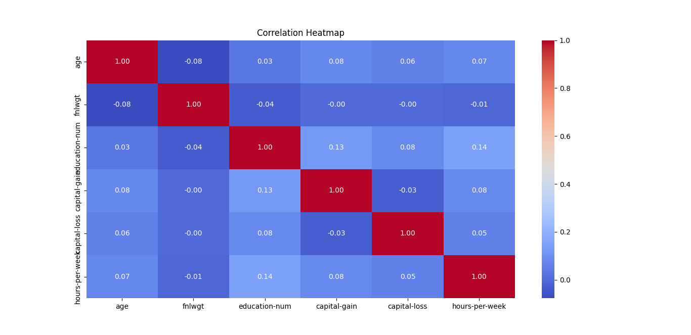
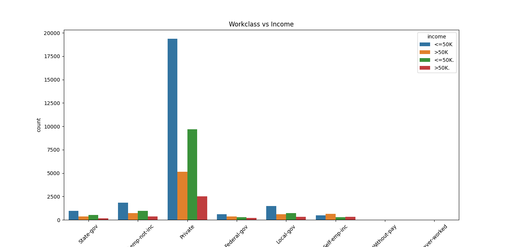
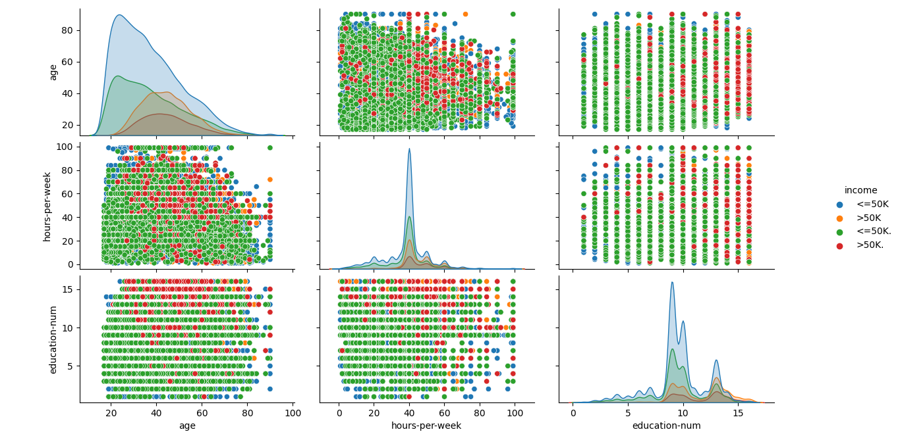

# Data Visualization Project: Adult Dataset

## Project Overview

This project focuses on visualizing the Adult dataset from the UCI Machine Learning Repository. The aim is to provide insights into the dataset through various visualizations, including bar plots, histograms, box plots, and correlation matrices.

## Dataset

The Adult dataset contains demographic information about individuals from the 1994 Census database, including attributes like age, education, work class, and income. You can access the dataset [here](https://archive.ics.uci.edu/dataset/2/adult).

## Project Structure

- `adult.csv`: The dataset used.
- `data_visualization_script.py`: Python script containing the code to generate visualizations.
- `Graphs/`: Directory containing saved plot images.

## Libraries Used

- `pandas`: For data manipulation and analysis.
- `numpy`: For numerical operations.
- `matplotlib`: For data visualization.
- `seaborn`: For enhanced data visualization.

## Visualizations Created

1. **Bar Plots**:
    - **Distribution of Workclass**: This plot shows the count of individuals across different work classes. It helps in understanding which work class is more prevalent in the dataset. Most individuals belong to the "Private" work class.
    

    - **Distribution of Education**: This plot displays the distribution of education levels. It reveals that most individuals have a high school diploma or some college education.
    

2. **Histograms**:
    - **Distribution of Age**: This histogram illustrates the age distribution, showing that the majority of individuals are between 20 and 50 years old, with a peak around 35.
    

    - **Distribution of Hours Per Week**: This plot depicts the distribution of hours worked per week. Most individuals work between 35 and 50 hours per week, with a noticeable spike at 40 hours.
    

3. **Box Plots**:
    - **Boxplot of Age**: The box plot shows the spread of age, including median age, quartiles, and any outliers. This plot provides insights into potential outliers such as very young or old individuals.
    

    - **Boxplot of Hours Per Week**: This box plot demonstrates the distribution of hours worked per week and highlights the spread of work hours along with any outliers working significantly more or fewer hours.
    

4. **Correlation Matrix**:
    - **Correlation Heatmap**: The heatmap shows the correlations between numerical variables such as age, education-num, hours-per-week, and income-related attributes. For example, there is a moderate positive correlation between education level and income.
    

5. **Count Plot**:
    - **Workclass vs Income**: This count plot compares income levels (above or below $50K) across different work classes. It shows that individuals from the "Private" work class are more likely to have lower income, while individuals from "Self-employed" or "Government" work classes are more likely to have higher income.
    

6. **Pair Plot**:
    - **Pairplot of Age, Hours Per Week, and Education Number**: The pair plot provides a visual representation of the relationships between these variables, with color-coded income levels. It shows how these variables interact, and the clusters formed can indicate trends between income and education or work hours.
    

